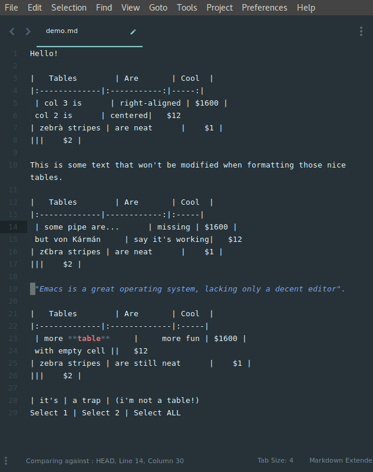

# tableMD (aka Markdown Table Formatter v0.0.20)

## To DO
- [] Delete unnecessary comments in code


## What's New
Added support for formatting tables correctly when they include vertical lines `|`. This fixes the formatting issues that occur when the 'pipe' symbol (`|` VERTICAL LINE, Unicode: U+007C, UTF-8: 7C) in included in a table's content.

**Raw Unformamatted Table**

```
a|b
-|-
`|`|foo
\\|bar
```

**Expected Formamatting**

```
| a   | b   |
|:----|:----|
| `|` | foo |
| \\  | bar |
```

**Actual Formatting**

```
| a  | b   |     |
|:---|:----|:----|
| `  | `   | foo |
| \\ | bar |     |
```

### CHANGES
1. Incorporates [code](https://github.com/bitwiser73/MarkdownTableFormatter/pull/17/files/) from [@sspkmnd](https://github.com/sspkmnd).
2. File Δ
  2.1 `tests/test.py` {most deletions were trailing spaces after table row entries},
  2.2 `tests/test.md`, and 
  2.3 `simple_markdown/table.py`
3. Name Δ to `tableMD` to avoid conflict with simultaneously testing both versions; plus it's kinda nerdishly cool. Table + Markdown + M.D. (Doctor of Medicine). Plus, since it's been a long time since the original has received any love, if skill and passion rise to the level of voluteering to taking it to the next level, it may require updated branding.
4. Shortcut Δ `Default (OSX).sublime-keymap`
  4.1 remapped key bindings back to original default * ,
  4.2 deleted key bindings for `Windows` and `Linux`
5. Deleted
  5.1 `Default (Linux).sublime-keymap`, and
  5.2 `Default (Windows).sublime-keymap`

* new shortcut key binding
```
    "keys": ["ctrl+alt+shift+t"],
```

# Markdown Table Formatter 1.0

[![travis][img-travis]](https://travis-ci.org/bitwiser73/MarkdownTableFormatter) [![MIT licensed][img-mit]](./LICENSE) [![Donate][img-paypal]][donate-paypal]

Sublime Text 3 markdown plugin that offers table formatting.

Inspired by the [Atom's version](https://atom.io/packages/markdown-table-formatter) from fcrespo82 (Fernando).

markdowntableformatter[at]gmail[.]com



## Usage

There are two basic ways of using this plugin. Select what you want to format and hit **Ctrl+Alt+Shift+T** or use the same shortcut without selection to format the entire document.  

## Configuration

```
{
  // make plugin verbose in debug console
  "verbose": false,

  // scan document to format tables when saving
  "autoformat_on_save": false,

  // spaces between "|" and cell's text
  "margin": 1,

  // additional spaces before/after cell's text (depending on justification)
  "padding": 0,

  // how text should be justified when not specified [LEFT, RIGHT, CENTER]
  "default_justification": "LEFT"
}
```

## Proper formatting

To be recognised properly by the plugin, Markdown tables must not contain white space in the line that separate the table heading from the other table rows.

For example, the following works:

```md
|:------------------|:---------------------|:-----------------|
```

This example will not work:

```md
|:------------------| ---------------------|:-----------------|
```

## Support it!

[![Donate][img-paypal]][donate-paypal]

[donate-paypal]: https://www.paypal.com/cgi-bin/webscr?cmd=_s-xclick&hosted_button_id=WAQUTBM9K8246
[img-travis]: https://travis-ci.org/bitwiser73/MarkdownTableFormatter.svg?branch=master
[img-mit]: https://img.shields.io/badge/license-MIT-blue.svg
[img-paypal]: https://img.shields.io/badge/Donate-PayPal-blue.svg
